# Crypto Trading Analysis & Tracking System

A comprehensive 24/7 cryptocurrency trading analysis and live tracking system that continuously monitors markets to detect volume and orderbook anomalies. The system combines real-time market data collection, orderbook analysis, and historical data analysis for automated trading strategy development and execution.

## 🏗️ Architecture Overview

The system consists of three main components:

1. **Tracker** - Live market data collection and orderbook analysis
2. **Backend** - API server for data access and analysis
3. **Analysis** - Local environment for strategy development and backtesting

## 🏛️ System Architecture Diagram

```mermaid
graph TB
    subgraph "External APIs"
        BINANCE[Binance API & WSS]
    end

    subgraph "Production Environment (Ubuntu 24.04)"
        subgraph "Docker Containers"
            subgraph "Backend Service"
                FASTAPI[FastAPI Backend]
                AUTH[Authentication]
                API[API Endpoints]
                BACKEND_WSS[WebSocket Client<br/>Live Trades Collection]
                LIVE_TRADES[Live Trades Processing]
            end

            subgraph "Tracker Service"
                TRACKER[Tracker Container]
                TRACKER_WSS[WebSocket Client<br/>Orderbook Pool]
                ORDERBOOK[Orderbook Analysis]
                VOLUME[Volume Analysis]
                ANOMALY[Anomaly Detection]
                BENCHMARK_PROC[Benchmark Processing]
                PREPROCESS[Data Preprocessing<br/>Market_Trades → Tracker]
            end

            subgraph "Database Layer"
                MONGODB[(MongoDB)]
                META[Metadata]
                TRACKER_DATA[Tracker Data<br/>Processed Data]
                MARKET_DATA[Market_Trades<br/>Raw Live Trades]
                BENCHMARK[Benchmark Data]
                ORDERBOOK_DATA[Orderbook Data<br/>Anomaly Alerts]
            end

            subgraph "Infrastructure"
                NGINX[Nginx Reverse Proxy]
                CERTBOT[SSL Certificates]
                MONGO_EXP[MongoDB Express]
            end
        end
    end

    subgraph "Analysis Environment"
        JUPYTER[Jupyter Notebooks]
        ANALYSIS[Analysis Scripts]
        BACKTEST[Backtesting]
        STRATEGY[Strategy Development]
    end

    subgraph "Data Flow Timeline"
        subgraph "Every Minute (Second = 0)"
            MIN1[Backend: Collect Live Trades<br/>All Pairs via WebSocket]
            MIN2[Save to Market Data DB]
        end

        subgraph "Every Minute (Second = 2)"
            SEC2[Tracker: Fetch Raw Data<br/>from Market_Trades DB]
            SEC3[Preprocess Data<br/>vs Daily Benchmark]
            SEC4[Save Processed Data<br/>to Tracker DB]
        end

        subgraph "24/7 Continuous"
            CONT1[WebSocket Pool: Orderbook<br/>Monitoring All Pairs]
            CONT2[Volume Anomaly Detection]
            CONT3[Tracker → Orderbook DB:<br/>Anomaly Alert for Focused Monitoring]
            CONT4[Adaptive Orderbook Saving<br/>Frequency based on Depth]
        end

        subgraph "Daily Maintenance (Midnight)"
            DAY1[Benchmark Computation]
            DAY2[Exchange Info Update]
            DAY3[Performance Monitoring]
        end
    end

    %% External connections
    BINANCE --> BACKEND_WSS
    BINANCE --> TRACKER_WSS

    %% Backend connections
    FASTAPI --> AUTH
    FASTAPI --> API
    BACKEND_WSS --> LIVE_TRADES
    LIVE_TRADES --> MARKET_DATA
    API --> MONGODB

    %% Tracker connections
    TRACKER_WSS --> ORDERBOOK
    ORDERBOOK --> VOLUME
    VOLUME --> ANOMALY
    ANOMALY --> ORDERBOOK_DATA
    TRACKER --> MONGODB
    BENCHMARK_PROC --> TRACKER_DATA
    PREPROCESS --> TRACKER_DATA
    MARKET_DATA --> PREPROCESS

    %% Database collections
    MONGODB --> META
    MONGODB --> TRACKER_DATA
    MONGODB --> MARKET_DATA
    MONGODB --> BENCHMARK
    MONGODB --> ORDERBOOK_DATA

    %% Infrastructure
    NGINX --> FASTAPI
    CERTBOT --> NGINX
    MONGO_EXP --> MONGODB

    %% Force vertical layout
    MONGODB --> MIN1

    %% Analysis connections
    JUPYTER --> MONGODB
    ANALYSIS --> MONGODB
    BACKTEST --> MONGODB
    STRATEGY --> MONGODB

    %% Data flow connections
    MIN1 --> MIN2
    MIN2 --> SEC2
    SEC2 --> SEC3
    SEC3 --> SEC4
    SEC4 --> TRACKER_DATA

    CONT1 --> CONT2
    CONT2 --> CONT3
    CONT3 --> ORDERBOOK_DATA
    CONT2 --> CONT4
    CONT4 --> ORDERBOOK_DATA

    DAY1 --> BENCHMARK
    DAY2 --> META
    DAY3 --> TRACKER_DATA

    %% Styling
    classDef external fill:#ff9999,stroke:#333,stroke-width:2px
    classDef service fill:#99ccff,stroke:#333,stroke-width:2px
    classDef database fill:#99ff99,stroke:#333,stroke-width:2px
    classDef infrastructure fill:#ffcc99,stroke:#333,stroke-width:2px
    classDef analysis fill:#cc99ff,stroke:#333,stroke-width:2px
    classDef dataflow fill:#ffff99,stroke:#333,stroke-width:2px

    class BINANCE external
    class TRACKER,TRACKER_WSS,ORDERBOOK,VOLUME,ANOMALY,BENCHMARK_PROC,PREPROCESS,FASTAPI,AUTH,API,BACKEND_WSS,LIVE_TRADES service
    class MONGODB,META,TRACKER_DATA,MARKET_DATA,BENCHMARK,ORDERBOOK_DATA database
    class NGINX,CERTBOT,MONGO_EXP infrastructure
    class JUPYTER,ANALYSIS,BACKTEST,STRATEGY analysis
    class MIN1,MIN2,SEC2,SEC3,SEC4,CONT1,CONT2,CONT3,CONT4,DAY1,DAY2,DAY3 dataflow
```



### Key Components:

- **🔴 External APIs**: Binance API & WSS integration for real-time market data
- **🔵 Services**: Python-based microservices for data collection, processing, and API delivery
- **🟢 Database**: MongoDB with specialized collections for different data types
- **🟠 Infrastructure**: Nginx reverse proxy, SSL certificates, and database management
- **🟣 Analysis**: Local development environment for strategy development and backtesting
- **🟡 Data Flow**: Real-time pipelines with precise timing, analysis workflows, and daily maintenance tasks

### Data Flow Timeline:

1. **Every Minute (Second = 0)**: Backend container collects live trades for all pairs via WebSocket and saves to Market_Trades database
2. **Every Minute (Second = 2)**: Tracker container fetches raw data from Market_Trades database, preprocesses it against daily benchmark, and saves processed data to Tracker database
3. **24/7 Continuous**: WebSocket pool monitors orderbook data for all pairs, with adaptive saving frequency based on orderbook depth
4. **Volume Anomaly Detection**: When tracker detects volume anomalies, it alerts the orderbook database to focus monitoring on specific pairs
5. **Daily Maintenance (Midnight)**: Benchmark computation, exchange info updates, and performance monitoring

## 🚀 Production Components

### Tracker Service (`/tracker`)

The tracker is the core component responsible for 24/7 live market data collection and real-time analysis, continuously monitoring for volume and orderbook anomalies.

#### Key Features:
- **24/7 Continuous Monitoring**: Non-stop market surveillance for volume and orderbook anomalies
- **Real-time Orderbook Tracking**: Monitors orderbook depth and order distribution patterns via WebSocket pool
- **Multi-Connection WebSocket Pooling**: Distributes orderbook monitoring across multiple WebSocket connections for scalability
- **Orderbook Analysis**: Real-time analysis of bid/ask order distribution and price levels
- **Anomaly Detection**: Automatic detection of volume spikes and orderbook distribution anomalies
- **Trading Event Detection**: Automatic detection of volatility events and trading opportunities
- **Volume Analysis**: Tracks buy/sell volume patterns across multiple timeframes (1m, 5m, 15m, 30m, 60m)
- **Live Trade Processing**: Fetches live trade data from database (collected by backend at second = 0) and preprocesses at second = 2
- **Benchmark Comparison**: Compares current volume against daily-computed benchmark data for relative volume analysis
- **Adaptive Orderbook Saving**: Frequency of orderbook data saving is determined by orderbook depth - fewer orders near current price = higher saving frequency
- **Daily Benchmark Computation**: Automatically computes volume averages and benchmarks at midnight daily
- **Exchange Info Management**: Updates instrument lists and trading pairs daily at 23:59:18
- **Performance Monitoring**: Tracks trading performance and updates metrics daily at 23:59:15
- **Risk Management**: Implements configurable risk parameters and loss limits

#### Main Components:
- `TrackerController.py` - Core tracking logic and volume calculations
- `BinanceController.py` - Binance API integration and exchange info management
- `TradingController.py` - Trading logic, order management, and performance monitoring
- `BenchmarkController.py` - Daily benchmark computation and volume average calculations
- `LoggingController.py` - Comprehensive logging and error tracking
- `wss-pool-order-book.py` - WebSocket orderbook pooling system for real-time orderbook analysis
- `main.py` - Primary tracking script that runs every minute
- `side-script.py` - Background script for daily maintenance tasks

#### Configuration:
- Environment variables control trading parameters, risk limits, and connection settings
- Risk management configuration stored in `/tracker/riskmanagement/riskmanagement.json`
- User configuration in `/tracker/user_configuration/userconfiguration.json`
- Trading live mode can be enabled/disabled per user in configuration
- Minimal notional values are automatically retrieved from exchange

### Backend Service (`/backend`)

FastAPI-based backend providing RESTful APIs for data access and analysis, including live trade information retrieval.

#### Key Features:
- **Live Trade Collection**: WebSocket client that collects live trades for all pairs every minute at second = 0
- **Live Trade Data APIs**: Real-time access to current market trades and volume data
- **Data Retrieval APIs**: Access to tracker, market, and benchmark data
- **Timeseries Analysis**: Historical data analysis with configurable timeframes
- **Orderbook Analysis**: Orderbook metadata and depth analysis
- **User Authentication**: Secure access control with JWT tokens
- **Real-time Data Streaming**: WebSocket endpoints for live data

#### Main Components:
- `AnalysisController.py` - Core analysis and data retrieval logic
- `BinanceController.py` - Binance API integration
- `AuthController.py` - Authentication and authorization
- `CryptoController.py` - Cryptocurrency-specific operations

#### API Endpoints:
- `/api/tracker/data` - Tracker data retrieval
- `/api/market/data` - Market trade data and live trade information
- `/api/benchmark/info` - Daily benchmark and volume information
- `/api/timeseries` - Historical timeseries data
- `/api/orderbook` - Orderbook analysis data

## 📊 Analysis Environment (`/analysis/Analysis2024`)

Local development environment for strategy development, backtesting, and data analysis.

### Key Features:
- **Strategy Development**: Jupyter notebooks for strategy testing and optimization
- **Historical Analysis**: Comprehensive backtesting framework
- **Data Visualization**: Interactive charts and performance metrics
- **Event Detection**: Pattern recognition and signal generation
- **Risk Assessment**: Portfolio risk analysis and optimization

### Main Components:
- `Analysis_official.ipynb` - Main analysis notebook
- `analyze_volatility.py` - Volatility analysis script
- `Functions.py` - Core analysis functions
- `Helpers.py` - Utility functions and helpers
- `launch_strategy.py` - Strategy execution script

### Data Structure:
- `timeseries_json/` - Historical timeseries data
- `analysis_json/` - Analysis results and outputs
- `riskmanagement_json/` - Risk management configurations
- `benchmark_json/` - Benchmark data and metrics

## 🐳 Deployment

### Docker Compose Configuration

The system uses Docker Compose for containerized deployment with the following services:

```yaml
services:
  backend:     # FastAPI backend service
  tracker:     # Live data tracking service
  mongo:       # MongoDB database
  mongo-express: # MongoDB web interface
  nginx:       # Reverse proxy and SSL termination
  certbot:     # SSL certificate management
```

### Environment Variables

Key environment variables for configuration:

```bash
# Database Configuration
MONGO_USERNAME=your_username
MONGO_PASSWORD=your_password
MONGO_DB_URL=mongo
MONGO_PORT=27017

# Trading Configuration
COINS_TRADED=BTCUSDT,ETHUSDT
MAXIMUM_LOSS=100
PRODUCTION=true

# WebSocket Configuration
SETS_WSS_BACKEND=5
MAX_CONNECTION_LOST=3
CONNECTION_COUNT=10

# Analysis Configuration
ANALYSIS=true
CHECK_PERIOD_MINUTES=1
```

### Production Deployment

1. **Build and Start Services**:
   ```bash
   docker-compose up -d mongo mongo-express tracker backend nginx
   ```

2. **Monitor Services**:
   ```bash
   docker-compose logs -f tracker
   docker-compose logs -f backend
   ```

3. **Service Scripts**:
   - **Main Script**: Runs every minute for tracking statistics
   - **Side Script**: Runs background maintenance tasks daily at 23:59
   - **Trading Live Mode**: Can be enabled/disabled per user configuration

4. **Access Services**:
   - Backend API: `https://your-domain.com/api/`
   - MongoDB Express: `https://your-domain.com/mongo/`
   - Nginx: `https://your-domain.com/`

## 📈 Data Flow

### Live Data Collection:
1. **Backend** collects live trade information from Binance WebSocket every minute at second = 0
2. **Backend** saves live trade data to MongoDB Market Data collection
3. **Tracker** fetches live trade data from database every minute at second = 2
4. **Tracker** preprocesses live trade data against daily benchmark for volume analysis
5. **WebSocket Orderbook Pooling** maintains multiple connections for 24/7 orderbook monitoring
6. **Volume Comparison** compares current volume against daily benchmark data
7. **Anomaly Detection** identifies volume spikes and orderbook distribution anomalies
8. **Adaptive Orderbook Saving** saves orderbook data with frequency based on orderbook depth
9. **Orderbook Analysis** processes bid/ask order distribution and detects trading events
10. **Risk Management** evaluates positions and applies risk controls
11. **Data Storage** saves processed data to MongoDB collections

### Daily Maintenance Tasks (Midnight):
- **23:59:15** - Performance monitoring and metrics update
- **23:59:18** - Exchange info update (instrument lists, trading pairs)
- **00:00:00** - Daily benchmark computation (volume averages)
- **00:00:00** - Coin list refresh and volume standings update

### Analysis Pipeline:
1. **Data Retrieval** - Fetch historical data from production database
2. **Event Detection** - Identify trading patterns and signals
3. **Strategy Testing** - Backtest strategies on historical data
4. **Performance Analysis** - Calculate metrics and generate reports
5. **Strategy Deployment** - Deploy validated strategies to production

## 🔧 Development Setup

### Local Development:

1. **Clone Repository**:
   ```bash
   git clone <repository-url>
   ```

2. **Configure Environment**:
   ```bash
   cp .env.example .env
   # Edit .env with your configuration
   ```

3. **Build and Start Services**:
   ```bash
   docker-compose up -d --build mongo-express mongo backend tracker nginx
   ```

### Analysis Environment:

2. **Run Analysis**:
   - Open `Analysis_official.ipynb`
   - Execute cells for data analysis and strategy testing
   - Use `analyze_volatility.py` for volatility analysis
   - Use `launch_strategy.py`for orderbook analysis

## 📊 Key Metrics and Analysis

## 📈 Results

The project has demonstrated promising results in identifying trading events that exhibit significant pullback patterns after substantial losses. The system's anomaly detection capabilities have proven effective in:

- **Loss Recovery Patterns**: Identifying events where significant price drops are followed by substantial pullbacks
- **Volume Anomaly Correlation**: Detecting unusual volume spikes that precede recovery movements
- **Orderbook Distribution Signals**: Recognizing orderbook anomalies that indicate potential reversal points
- **Risk-Reward Optimization**: Finding trading opportunities with favorable risk-reward ratios during market corrections

The automated 24/7 monitoring system continuously scans for these patterns across multiple cryptocurrency pairs, providing real-time alerts for potential trading opportunities.

### Volume Analysis:
- **24/7 Volume Monitoring**: Continuous surveillance of trading volume across all monitored pairs
- **Relative Volume**: Current volume vs. daily benchmark (computed once per day)
- **Buy/Sell Ratio**: Buy volume percentage analysis
- **Volume Momentum**: 7-day volume trends
- **Benchmark Comparison**: Real-time volume comparison against historical benchmarks
- **Volume Standings**: Dynamic ranking of most traded coins based on volume
- **Best Coins Selection**: Automatic selection of top-performing coins for tracking
- **Anomaly Detection**: Automatic identification of unusual volume patterns and spikes

### Orderbook Analysis:
- **24/7 Orderbook Monitoring**: Continuous surveillance of orderbook depth and distribution
- **Order Distribution**: Bid/ask order concentration and distribution patterns
- **Price Levels**: Key support/resistance levels and jump price detection
- **Market Depth**: Liquidity analysis at different levels
- **Multi-Connection Pooling**: Scalable WebSocket connections for high-frequency orderbook monitoring
- **Anomaly Detection**: Automatic identification of orderbook distribution anomalies
- **Event Detection**: Automatic detection of volatility events and trading opportunities
- **Real-time Processing**: Continuous orderbook analysis with configurable update frequencies

### Trading Signals:
- **Volume Spikes**: Unusual volume activity detection
- **Price Patterns**: Technical pattern recognition and jump price level detection
- **Orderbook Events**: Bid/ask order distribution anomalies
- **Volatility Events**: Automatic detection of market volatility patterns
- **Risk Events**: High-risk market conditions
- **Trading Opportunities**: Real-time identification of potential buy/sell signals

## 🔒 Security and Risk Management

### Risk Controls:
- **Position Limits**: Maximum position sizes per coin
- **Loss Limits**: Maximum daily loss thresholds
- **Exposure Limits**: Maximum portfolio exposure
- **Order Limits**: Maximum order sizes and frequencies

### Data Security:
- **Authentication**: Secure API access control
- **Encryption**: SSL/TLS for data transmission
- **Backup**: Regular database backups
- **Monitoring**: Comprehensive logging and alerting

## 📝 API Documentation

### Core Endpoints:

#### Tracker Data
```http
GET /api/tracker/data?start=2024-01-01T00:00:00&end=2024-01-02T00:00:00
```

#### Market Data
```http
GET /api/market/data?start=2024-01-01T00:00:00&end=2024-01-02T00:00:00
```

#### Benchmark Information
```http
GET /api/benchmark/info
```

#### Timeseries Analysis
```http
POST /api/timeseries
Content-Type: application/json

{
  "event_key": "buy_vol_1m:0/vol_1m:75/timeframe:1440/lvl:200",
  "start_date": "2024-01-01T00:00:00",
  "end_date": "2024-01-02T00:00:00"
}
```

## 🤝 Contributing

- Contact: **Alberto Rainieri** - alberto.rainieri.lavoro@gmail.com


**Note**: This system shows promising results in detecting volume and orderbook anomalies, but has not yet achieved consistent profitability in live trading. After 2 years of development, the project demonstrates solid technical architecture and anomaly detection capabilities, though further optimization is needed for steady returns.

**Data Assets**: The system has collected extensive historical data including orderbook snapshots, volume patterns, and trading events across multiple cryptocurrency pairs. This rich dataset provides valuable insights for strategy development and backtesting.

**Open for Collaboration**: I'm actively seeking collaborators, contributors, or partners to help improve the system's performance. Whether you're interested in:
- Contributing code improvements
- Testing and validation
- Strategy optimization
- Commercial partnerships
- Data analysis and research

Please reach out: **Alberto Rainieri** - alberto.rainieri.lavoro@gmail.com